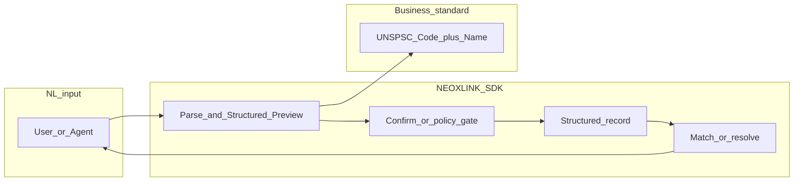

# NEOXLINK-SDK

<!-- mcp-name: io.github.neowalter/neoxlink -->

[](https://pypi.org/project/neoxlink/)
[](https://www.python.org/downloads/)
[](LICENSE)
[](https://modelcontextprotocol.io/)
[](docs/wiki/unspsc-quick-ref.md)
[](docs/wiki/mcp-integration.md)
[](docs/wiki/agent-channel-matrix.md)
[](docs/wiki/repository-layout.md)

**From natural language to machine-readable intent** — turn fuzzy requirements into **structured representations** (schemas, codes, confirmed records) that **existing software systems** can parse, route, and execute—not only one vertical.

> **Vision:** NEOXLINK-SDK closes the gap between “the model paraphrased the user” and “downstream systems can consume a deterministic payload.” It normalizes free text using the **UNSPSC global standard (Code + Name)** where product/service classification applies, **Structured Preview**, human or agent confirmation, durable structured records, and **AI Resolve** (answers or handoff to fulfillment). The same pipeline plugs into **procurement, CRM, ERP, marketplaces, ticketing, or custom stacks**—with **plugins**, overrides, and **MCP (Model Context Protocol)** so agents and apps stay interoperable.

[中文文档 `README_zh.md`](README_zh.md) · [UNSPSC 快速查阅（同仓）](docs/wiki/unspsc-quick-ref.md) · [MCP 集成说明](docs/wiki/mcp-integration.md)

## System architecture (natural language → structured, system-ready output)

High-level data path from natural language to **standardized, machine-readable** records you can forward to any backend. (Diagram is a *logical* view; your deployment may split API, matching, and MCP host.)



For the **maintained** layering diagram (HTTP client vs local UNSPSC catalog vs orchestration), see [docs/wiki/repository-layout.md](docs/wiki/repository-layout.md) — it is versioned with the repo and mirrors what CI tests against.

## The gap (and how we close it)

Classic chat AI stops at paraphrasing. Real systems—**CRM, ERP, procurement, compliance, marketplaces, internal tools**—need **codes, constraints, and structured fields**. NEOXLINK-SDK turns messy language into **structured business instructions**, often aligned to **UNSPSC** for goods and services, then supports **Supply-Demand Matching** (and other workflows) on the same normalized axis.

| Dimension | Traditional AI chat | NEOXLINK-SDK |
| --- | --- | --- |
| Output | Free-form text | **Structured Preview** + typed payloads |
| Taxonomy | Ad-hoc labels | **UNSPSC (Code + Name)** normalization where applicable |
| Downstream readiness | Low | Parse → confirm → structured store → **resolve / match** |
| Agent integration | Ad-hoc prompts | **Skill** adapters + **MCP** tool surface |
| Matching | Semantic vibes only | **Supply-Demand Matching** with explicit signals (example domain) |

## Features

- **NL → structured intent** — requirements become fields, codes, and artifacts systems can ingest.
- **UNSPSC-first taxonomy** — consistent **Code + Name** when classifying products and services.
- **Structured Preview** — LLM-refined structure before anything is committed.
- **Human / agent confirmation** — overrides and policy gates before persistence (personalized flows).
- **Structured persistence** — records land in a pipeline you can connect to existing systems.
- **AI Resolve** — direct answers or routing toward the right backend or fulfillment.
- **Supply-Demand Matching** — staged `ProcurementIntentEngine` with pluggable data and ranking (one built-in pattern; extend for other domains).
- **Agent Interoperability** — `NeoxlinkSkill`, `NeoxlinkMCPAdapter`, and chain-style orchestration.
- **MCP tool exposure** — stable tool names such as `neoxlink.parse_preview` and `neoxlink.confirmed_submit`.

## Core flow

1. **Natural language in** — user or agent describes the need in plain language.  
2. **LLM Structured Preview** — intent is refined into a preview (including **UNSPSC** when classifying offerings).  
3. **User / agent confirm** — approve or edit; business truth is explicit.  
4. **Structured store** — confirmed record is ready for **your** APIs, webhooks, ERP, or marketplace.  
5. **AI Resolve** — answer, escalate, or connect to the appropriate downstream process.

## Quick start

**Install**

```bash
pip install neoxlink
# or, from this repo:
pip install -e .
```

**Minimal Python: `SDK` + Structured Preview**

```python
from neoxlink import SDK

sdk = SDK(
    base_url="https://neoxailink.com",
    api_key="ak_live_xxx",  # your NeoXlink API key
)
draft = sdk.parse_preview(
    "We need urgent packaging compliance consulting for EU retail launch.",
    entry_kind="demand",
)
print(draft.preview.unspsc.code, draft.preview.unspsc.name)
```

> Advanced integrations use `neoxlink_sdk` directly (`NeoXlinkClient`, `StructuredSubmissionPipeline`, `ProcurementIntentEngine`, `NeoxlinkMCPAdapter`). See `examples/` and the sections below.

**Run a local example**

```bash
pip install -e .
python examples/04_procurement_intent_engine.py
```

**MCP (Model Context Protocol) stdio server**

```bash
pip install 'neoxlink[mcp]'
export NEOXLINK_API_KEY=your_key
neoxlink-mcp
```

Point your MCP host (Claude Desktop, Cursor, etc.) at the `neoxlink-mcp` command, or use the config template in [`mcp/config.neoxlink.example.json`](mcp/config.neoxlink.example.json). Optional: `NEOXLINK_ENABLE_MATCH=1` to expose `neoxlink.match_intent` (local matching pipeline; supply your own data source in custom deployments).

## Agent quick connect (MCP & Skills)

**One capability unit, three lines — install, run, verify**

```bash
export NEOXLINK_API_KEY="your_key"
uvx --from 'neoxlink[mcp]' neoxlink-mcp
# In Cursor / Claude Code / Claude Desktop: register this process as an MCP server (stdio), then list tools.
```

Equivalent with pip: `pip install 'neoxlink[mcp]' && neoxlink-mcp`. Use [`mcp-config.json`](mcp-config.json) or [`mcp/config.neoxlink.example.json`](mcp/config.neoxlink.example.json) as host templates. Debug any MCP server with `npx -y @modelcontextprotocol/inspector` when using HTTP transport; **this** package speaks **stdio** by default.

**Channels**

| Surface | How agents load NEOXLINK |
| --- | --- |
| **MCP (local)** | Stdio command `neoxlink-mcp` after `pip install 'neoxlink[mcp]'` or `uvx --from 'neoxlink[mcp]' neoxlink-mcp`. |
| **MCP (registry)** | Optional MCP Registry publish via `server.json` + `mcp-publisher` — see [docs/wiki/mcp-integration.md](docs/wiki/mcp-integration.md). |
| **OpenClaw / ClawHub** | AgentSkills folder with `SKILL.md` + install via `openclaw skills install` / `clawhub`; point instructions at the same MCP tools. Example assets: [`integrations/openclaw-clawhub-skill/`](integrations/openclaw-clawhub-skill/). |
| **Hermes** | Configure NEOXLINK as an MCP server in Hermes so `discover_mcp_tools()` exposes `neoxlink.*`; for native plugins use a separate Hermes plugin package with `hermes_agent.plugins` entry points. |
| **Skillshub-style catalogs** | Ship [`integrations/skillshub/skill-manifest.json`](integrations/skillshub/skill-manifest.json) to registries that ingest JSON manifests; runtime still launches `neoxlink-mcp`. |

**Full channel matrix, copy-paste checklists, and 2026 protocol notes:** [docs/wiki/agent-channel-matrix.md](docs/wiki/agent-channel-matrix.md).

## Use cases

- **Any system that needs structured intake** — turn chat or voice into payloads your **CRM, ERP, ticketing, or custom API** already understands.  
- **Global procurement & sourcing** (one strong fit) — standardize requisitions and catalogs with **UNSPSC**.  
- **Cross-border trade & compliance** — align multilingual requests with a shared taxonomy where codes matter.  
- **B2B marketplaces & integrations** — conversational front ends with deterministic records for partners.  
- **Agent products** — ship **MCP** tools or **Skill** contracts without inventing a new ontology from scratch.  
- **Personalized automation** — confirmation steps, overrides, and plugins adapt flows per tenant or policy.  
- **Supply-Demand Matching** — rank counterparties with transparent scoring on normalized intent (reference engine in-repo).

## Architecture highlights (v0.6.4)

| Module | Role |
| --- | --- |
| `neoxlink_sdk.client.NeoXlinkClient` | HTTP client: `parse_entry`, `confirm_entry`, `resolve_entry`, `structured_submit`. |
| `neoxlink_sdk.pipeline.StructuredSubmissionPipeline` | Parse → confirm → resolve orchestration (`ParseDraft`, `ConfirmedEntry`, `ResolveResult`). |
| `neoxlink_sdk.engine.ProcurementIntentEngine` | Staged matching: intent → **UNSPSC** → clarification → retrieval → ranking. |
| `neoxlink_sdk.skill.NeoxlinkSkill` | Skill-runtime adapter (preview vs auto-confirm). |
| `neoxlink_sdk.mcp.NeoxlinkMCPAdapter` | **MCP**-friendly tool facade for **Agent Interoperability**. |
| `neoxlink_sdk.credits` | Credit / BYOM metering for metered clients. |
| `neoxlink_sdk.plugins.PluginRegistry` | Register model adapters, data sources, ranking strategies. |

The **in-repo** wiki also documents [on-disk layout, HTTP vs UNSPSC layers, and running tests (Python 3.11+)](docs/wiki/repository-layout.md). Open-source “module one–eight” design remains in [REPOSITORY_ARCHITECTURE.md](REPOSITORY_ARCHITECTURE.md).

**Open-source community layout**

1. [Templates](community/01_templates.md)  
2. [Examples](community/02_examples.md)  
3. [Plugins](community/03_plugins.md)  
4. [Contributors](community/04_contributors.md)  
5. [Ecosystem](community/05_ecosystem.md)  
6. [Adoption](community/06_adoption.md)

**Governance & scope**

- [OPEN_SOURCE_SCOPE.md](OPEN_SOURCE_SCOPE.md)  
- [REPOSITORY_ARCHITECTURE.md](REPOSITORY_ARCHITECTURE.md)  
- [CONTRIBUTOR_WORKFLOW.md](CONTRIBUTOR_WORKFLOW.md)  
- [DATA_COLLABORATION_GUIDELINES.md](DATA_COLLABORATION_GUIDELINES.md)  
- [PROMPT_COLLABORATION.md](PROMPT_COLLABORATION.md)  
- [GOVERNANCE.md](GOVERNANCE.md)

## Extended examples

- `examples/01_structured_pipeline.py` — parse / confirm / resolve  
- `examples/02_skill_runtime.py` — Skill runtime  
- `examples/03_chain_style.py` — chain-style invocation  
- `examples/04_procurement_intent_engine.py` — **UNSPSC** matching engine  
- `examples/05_credits_and_byom.py` — credits & BYOM  
- `examples/06_plugin_registry.py` — plugins  
- `examples/07_open_source_pipeline.py` — open-source reference pipeline  
- `examples/08_startup_policy_realworld.py` — interactive advisor  
- `examples/model_apis/` — OpenAI, Anthropic, Gemini, Ollama, router  
- `neoxlink-mcp` + `mcp/config.neoxlink.example.json` — MCP stdio server for agent hosts  

Optional extras for model examples:

```bash
pip install -e ".[model_examples]"
```

## Local development

This package targets **Python 3.11+** (`requires-python` in `pyproject.toml`). Run the test suite with a 3.11+ interpreter (system `python3` on some macOS installs is 3.9 and will not load the type annotations used in the code):

```bash
python3.11 -m venv .venv
.venv/bin/pip install -e ".[dev]"
.venv/bin/python -m pytest
```

## Community

- [community/README.md](community/README.md)  
- [CONTRIBUTING.md](CONTRIBUTING.md)  
- [CODE_OF_CONDUCT.md](CODE_OF_CONDUCT.md)

## License

MIT
