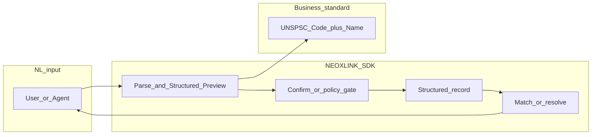

# NEOXLINK-SDK

[](https://pypi.org/project/neoxlink-sdk/)
[](https://www.python.org/downloads/)
[](LICENSE)
[](https://modelcontextprotocol.io/)
[](docs/wiki/unspsc-quick-ref.md)
[](docs/wiki/mcp-integration.md)

**Bridging the gap between Chat and Transaction** — turn fuzzy natural language into **Standardized Business Intelligence** and executable procurement workflows.

> **Vision:** NEOXLINK-SDK is the **operating system for AI commercialization**. It closes the last mile between “the model understood the request” and “the business system can act on it” by normalizing intent with the **UNSPSC global standard (Code + Name)**, **Structured Preview**, human or agent confirmation, durable structured records, and **AI Resolve** (direct answers or real supply-chain handoff). **Agent Interoperability** is first-class: integrate directly, run inside **Skill** runtimes, or expose capabilities via **MCP (Model Context Protocol)** tools.

[中文文档 `README_zh.md`](README_zh.md) · [UNSPSC 快速查阅（同仓）](docs/wiki/unspsc-quick-ref.md) · [MCP 集成说明](docs/wiki/mcp-integration.md)

## System architecture (chat → transaction)

High-level data path from natural language to **standardized, actionable** records. (Diagram is a *logical* view; your deployment may split API, matching, and MCP host.)



*Placeholder for a future architecture diagram file:* add your swimlane (API vs agent vs ERP) in `docs/wiki/` and link it here as the “official” network picture for releases.

## The gap (and how we close it)

Classic chat AI stops at paraphrasing needs. Enterprise procurement, trading, and compliance systems speak **codes, constraints, and structured intents** — not paragraphs. NEOXLINK-SDK translates messy language into **structured business instructions** aligned to **UNSPSC**, then supports **Supply-Demand Matching** on the same normalized axis.

| Dimension | Traditional AI chat | NEOXLINK-SDK |
| --- | --- | --- |
| Output | Free-form text | **Structured Preview** + typed payloads |
| Taxonomy | Ad-hoc labels | **UNSPSC (Code + Name)** normalization |
| Transaction readiness | Low | Parse → confirm → structured DB → **resolve / match** |
| Agent integration | Ad-hoc prompts | **Skill** adapters + **MCP** tool surface |
| Matching | Semantic vibes only | **Supply-Demand Matching** with explicit signals |

## Features

- **UNSPSC-first taxonomy** — consistent **Code + Name** for demand and supply.
- **Structured Preview** — LLM-refined structure before anything is committed.
- **Human / agent confirmation** — overrides and policy gates before persistence.
- **Structured persistence** — records land in a structured pipeline ready for operators.
- **AI Resolve** — AI-direct answers or routing toward real fulfillment.
- **Supply-Demand Matching** — staged `ProcurementIntentEngine` with pluggable data and ranking.
- **Agent Interoperability** — `NeoxlinkSkill`, `NeoxlinkMCPAdapter`, and chain-style orchestration.
- **MCP tool exposure** — stable tool names such as `neoxlink.parse_preview` and `neoxlink.confirmed_submit`.

## Core flow

1. **Natural language in** — buyer, seller, or agent describes the need in plain language.  
2. **LLM Structured Preview** — intent is refined into a preview (including **UNSPSC** where applicable).  
3. **User / agent confirm** — approve or edit; business truth is explicit.  
4. **Structured database** — confirmed record is stored for downstream systems.  
5. **AI Resolve** — answer, escalate, or connect to real supply / fulfillment.

## Quick start

**Install**

```bash
pip install neoxlink-sdk
# or, from this repo:
pip install -e .
```

**Minimal Python: `SDK` + Structured Preview**

```python
from neoxlink import SDK

sdk = SDK(
    base_url="https://neoxailink.com",
    api_key="ak_live_xxx",  # your NeoXlink API key
)
draft = sdk.parse_preview(
    "We need urgent packaging compliance consulting for EU retail launch.",
    entry_kind="demand",
)
print(draft.preview.unspsc.code, draft.preview.unspsc.name)
```

> Advanced integrations use `neoxlink_sdk` directly (`NeoXlinkClient`, `StructuredSubmissionPipeline`, `ProcurementIntentEngine`, `NeoxlinkMCPAdapter`). See `examples/` and the sections below.

**Run a local example**

```bash
pip install -e .
python examples/04_procurement_intent_engine.py
```

**MCP (Model Context Protocol) stdio server**

```bash
pip install 'neoxlink-sdk[mcp]'
export NEOXLINK_API_KEY=your_key
neoxlink-mcp
```

Point your MCP host (Claude Desktop, Cursor, etc.) at the `neoxlink-mcp` command, or use the config template in [`mcp/config.neoxlink.example.json`](mcp/config.neoxlink.example.json). Optional: `NEOXLINK_ENABLE_MATCH=1` to expose `neoxlink.match_intent` (local matching pipeline; supply your own data source in custom deployments).

## Use cases

- **Global procurement & sourcing** — standardize requisitions and supplier catalogs across regions using **UNSPSC**.  
- **Cross-border trade** — align multilingual requests with a single commodity and service taxonomy for RFQs and compliance.  
- **B2B marketplaces & ERP handoff** — turn conversational intake into records that downstream systems can ingest.  
- **Agent products** — ship **MCP** tools or **Skill** contracts without reinventing procurement ontology.  
- **Supply-Demand Matching** — rank partners with transparent scoring on top of normalized intent.

## Architecture highlights (v0.6)

| Module | Role |
| --- | --- |
| `neoxlink_sdk.client.NeoXlinkClient` | HTTP client: `parse_entry`, `confirm_entry`, `resolve_entry`, `structured_submit`. |
| `neoxlink_sdk.pipeline.StructuredSubmissionPipeline` | Parse → confirm → resolve orchestration (`ParseDraft`, `ConfirmedEntry`, `ResolveResult`). |
| `neoxlink_sdk.engine.ProcurementIntentEngine` | Staged matching: intent → **UNSPSC** → clarification → retrieval → ranking. |
| `neoxlink_sdk.skill.NeoxlinkSkill` | Skill-runtime adapter (preview vs auto-confirm). |
| `neoxlink_sdk.mcp.NeoxlinkMCPAdapter` | **MCP**-friendly tool facade for **Agent Interoperability**. |
| `neoxlink_sdk.credits` | Credit / BYOM metering for metered clients. |
| `neoxlink_sdk.plugins.PluginRegistry` | Register model adapters, data sources, ranking strategies. |

**Open-source community layout**

1. [Templates](community/01_templates.md)  
2. [Examples](community/02_examples.md)  
3. [Plugins](community/03_plugins.md)  
4. [Contributors](community/04_contributors.md)  
5. [Ecosystem](community/05_ecosystem.md)  
6. [Adoption](community/06_adoption.md)

**Governance & scope**

- [OPEN_SOURCE_SCOPE.md](OPEN_SOURCE_SCOPE.md)  
- [REPOSITORY_ARCHITECTURE.md](REPOSITORY_ARCHITECTURE.md)  
- [CONTRIBUTOR_WORKFLOW.md](CONTRIBUTOR_WORKFLOW.md)  
- [DATA_COLLABORATION_GUIDELINES.md](DATA_COLLABORATION_GUIDELINES.md)  
- [PROMPT_COLLABORATION.md](PROMPT_COLLABORATION.md)  
- [GOVERNANCE.md](GOVERNANCE.md)

## Extended examples

- `examples/01_structured_pipeline.py` — parse / confirm / resolve  
- `examples/02_skill_runtime.py` — Skill runtime  
- `examples/03_chain_style.py` — chain-style invocation  
- `examples/04_procurement_intent_engine.py` — **UNSPSC** matching engine  
- `examples/05_credits_and_byom.py` — credits & BYOM  
- `examples/06_plugin_registry.py` — plugins  
- `examples/07_open_source_pipeline.py` — open-source reference pipeline  
- `examples/08_startup_policy_realworld.py` — interactive advisor  
- `examples/model_apis/` — OpenAI, Anthropic, Gemini, Ollama, router  
- `neoxlink-mcp` + `mcp/config.neoxlink.example.json` — MCP stdio server for agent hosts  

Optional extras for model examples:

```bash
pip install -e ".[model_examples]"
```

## Community

- [community/README.md](community/README.md)  
- [CONTRIBUTING.md](CONTRIBUTING.md)  
- [CODE_OF_CONDUCT.md](CODE_OF_CONDUCT.md)

## License

MIT
