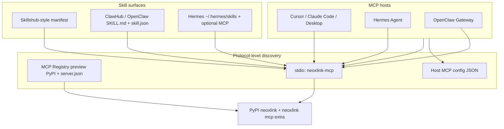

# Agent interoperability channel matrix (NEOXLINK / neoxlink)

This page is the **structured channel map** for loading **neoxlink** as an AI capability unit across **MCP** (protocol) and **Skill** (instruction + registry) surfaces. It complements [mcp-integration.md](mcp-integration.md) and the checked-in manifests under `integrations/`.

## Channel matrix (local · cloud · cross-platform)



| Channel | Primary mechanism (2026) | Typical host | Install / load pattern |
| --- | --- | --- | --- |
| **MCP · PyPI + stdio** | Console script from `[project.scripts]`; optional Registry `server.json` | Cursor, Claude Code, Claude Desktop | `pip install 'neoxlink[mcp]'` → `neoxlink-mcp`; or `uvx` one-liner |
| **MCP · Registry preview** | `mcp-publisher` + `server.json` + README `<!-- mcp-name: ... -->` | MCP-aware clients that consume the registry | Publish package → `mcp-publisher publish` (see [mcp-integration.md](mcp-integration.md)) |
| **OpenClaw / ClawHub** | **AgentSkills** folder (`SKILL.md` + frontmatter), CLI `openclaw skills install` / `clawhub` | OpenClaw gateway, workspace `skills/` | Publish or vendor skill; agent loads by name / registry |
| **Hermes** | **MCP tool discovery** + optional **plugins** (`hermes_agent.plugins` entry point) + **skills** dir | Hermes CLI / daemons | Configure MCP server → `discover_mcp_tools()`; or ship plugin wheel |
| **Skillshub / catalog** | Vendor **manifest** (`skill-manifest.json`) pointing at `pip_spec` + `entry_command` | Registries that ingest JSON manifests | POST manifest per vendor API; runtime still launches `neoxlink-mcp` |

## Live research notes (condensed, 2026)

- **MCP Python SDK:** The maintained surface is the **`mcp`** package on PyPI (stdio, **Streamable HTTP**; SSE increasingly treated as legacy in client docs). Build servers with `mcp.server.Server` / `FastMCP`, or wrap an existing library with `list_tools` / `call_tool` handlers as this repo does in `neoxlink_sdk/mcp_server.py`.
- **“Auto wrap” pattern:** There is no single magic `mcp-python-sdk` import that turns arbitrary packages into MCP servers. The practical pattern is: **thin stdio entrypoint** + **stable tool names** + **Pydantic/OpenAPI-aligned schemas** + **`[project.scripts]`** so `uvx`/`pipx` can launch the server without cloning.
- **OpenClaw:** Skills are **AgentSkills-compatible** directories (`SKILL.md` with YAML frontmatter; **single-line** keys / one-line `metadata` JSON per parser limits). Loading paths include bundled skills, `~/.openclaw/skills`, workspace `skills/`, and plugin-declared dirs (`openclaw.plugin.json`). **MCP** is a first-class integration path for “structured tool use” alongside skills.
- **Hermes:** Loads **MCP** tools from host configuration early in startup, then **plugin** tools (`register()` entry). Skills follow **agentskills.io**-style progressive disclosure; external skill dirs can be merged for discovery. Distributing Python extensions is idiomatically **`[project.entry-points."hermes_agent.plugins"]`** in *Hermes plugins*, not by importing PyPI names as tools directly.

## MCP channel — core checklist

1. **Depend on the extra:** `pip install 'neoxlink[mcp]'` (installs `mcp`, `anyio`).
2. **Expose a console script:** `neoxlink-mcp` → `neoxlink_sdk.mcp_server:main` (see `pyproject.toml`).
3. **Configure the host** with **stdio** `command` + `args` + env (`NEOXLINK_API_KEY`, optional `NEOXLINK_BASE_URL`, `NEOXLINK_ENABLE_MATCH`).
4. **Validate tools:** `npx -y @modelcontextprotocol/inspector` against your server URL if you use HTTP transport; for **stdio**, use your host’s MCP UI or a small Python `ClientSession` smoke test.
5. **Registry (optional):** Keep `server.json` in sync with PyPI version; README must include the MCP Registry **HTML comment** matching the server id (see [mcp-integration.md](mcp-integration.md)).

### `pyproject.toml` pattern (already used by this repo)

```toml
[project.optional-dependencies]
mcp = ["mcp>=1.0.0", "anyio>=4.0.0"]

[project.scripts]
neoxlink-mcp = "neoxlink_sdk.mcp_server:main"
```

### Copy-paste: uvx (no venv)

```bash
export NEOXLINK_API_KEY="your_key"
uvx --from 'neoxlink[mcp]' neoxlink-mcp
```

### Copy-paste: Cursor / Claude-style MCP fragment (stdio)

Use the repo templates: root [`mcp-config.json`](../../mcp-config.json) or [`mcp/config.neoxlink.example.json`](../../mcp/config.neoxlink.example.json). Minimal shape:

```json
{
  "mcpServers": {
    "neoxlink": {
      "command": "uvx",
      "args": ["--from", "neoxlink[mcp]", "neoxlink-mcp"],
      "env": {
        "NEOXLINK_API_KEY": "${NEOXLINK_API_KEY}"
      }
    }
  }
}
```

**Note:** `npx` is for **Node** MCP servers (and the Inspector). For **this** Python package, prefer **`uvx`** or a venv where `neoxlink-mcp` is on `PATH`.

### Adapter template (minimal `mcp.server.Server` stdio)

See the production implementation in [`neoxlink_sdk/mcp_server.py`](../../neoxlink_sdk/mcp_server.py). Greenfield pattern:

```python
# /// script
# dependencies = ["mcp", "anyio"]
# ///
import anyio
from mcp.server import Server
from mcp.server.stdio import stdio_server

app = Server("my-server")

@app.list_tools()
async def list_tools(_):
    ...

@app.call_tool()
async def call_tool(name: str, arguments: dict | None):
    ...

def main() -> None:
    async def run():
        async with stdio_server() as streams:
            await app.run(streams[0], streams[1], app.create_initialization_options())
    anyio.run(run)

if __name__ == "__main__":
    main()
```

## Skill channel — core checklist

1. **Publish instructions** the model can load on demand (**`SKILL.md`**) with clear tool names matching MCP (`neoxlink.parse_preview`, etc.).
2. **Pin runtime:** `pip install 'neoxlink[mcp]==<version>'` in skill metadata / install hooks.
3. **Declare env:** `NEOXLINK_API_KEY` required; document optional `NEOXLINK_BASE_URL`, `NEOXLINK_ENABLE_MATCH`.
4. **Registry manifest:** For Skillshub-style catalogs, ship JSON with `runtime.pip_spec`, `runtime.entry_command`, and tool/resource summaries (see `integrations/skillshub/skill-manifest.json`).
5. **OpenClaw:** Prefer **`openclaw skills install`** / **ClawHub** workflow; gate optional binaries via `metadata.openclaw.requires.*` when needed.

### Manifest examples in this repo

| Target | File |
| --- | --- |
| Skillshub-style | [`integrations/skillshub/skill-manifest.json`](../../integrations/skillshub/skill-manifest.json) |
| OpenClaw / ClawHub companion | [`integrations/openclaw-clawhub-skill/manifest.openclaw.example.json`](../../integrations/openclaw-clawhub-skill/manifest.openclaw.example.json) |
| Legacy `skill.json` | [`integrations/openclaw-clawhub-skill/neoxlink-sdk-0-6-0/skill.json`](../../integrations/openclaw-clawhub-skill/neoxlink-sdk-0-6-0/skill.json) |

## PyPI metadata → “semantic tool” awareness

Agents discover tools through **MCP `list_tools` descriptions** and **host-specific registries**, not by importing PyPI names as Python symbols. Maximize discoverability by keeping **[project] `description`**, **`keywords`**, and **`[project.urls]`** accurate in `pyproject.toml`, and by aligning **tool `description` strings** in `NeoxlinkMCPAdapter` with the same vocabulary (UNSPSC, procurement, B2B, MCP). Optional: publish **OpenAPI** (`openapi.json`) and link it from manifests (already done in `skill-manifest.json`).

## Three-line validation (“install → run → probe”)

```bash
export NEOXLINK_API_KEY="your_key"
uvx --from 'neoxlink[mcp]' neoxlink-mcp   # line 1–2: install+run via uvx; or: pip install 'neoxlink[mcp]' && neoxlink-mcp
# line 3: in the MCP host, run: list tools → expect neoxlink.parse_preview / neoxlink.confirmed_submit
```

In-process smoke (optional fourth line):

```bash
python -c "from neoxlink_sdk.mcp_server import build_adapter; a=build_adapter(); print([t['name'] for t in a.list_tools()])"
```
