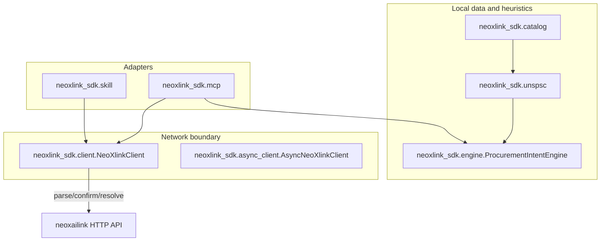

# Repository layout (SDK vs open-source reference)

**Purpose:** This page describes the **on-disk** layout of a clone of NEOXLINK-SDK, how the **public API** maps to packages, and how **network I/O** is kept separate from **UNSPSC catalog** logic. Deeper “module one–eight” open-source design lives in [REPOSITORY_ARCHITECTURE.md](../../REPOSITORY_ARCHITECTURE.md) at the repository root.

## Top-level map

| Path | Role |
| --- | --- |
| `neoxlink/` | Thin import alias (`from neoxlink import SDK`); re-exports the SDK entry points. |
| `neoxlink_sdk/` | Main library: HTTP client, pipelines, **UNSPSC** heuristics, MCP/Skill, plugins, and `open_source/` reference stack. |
| `tests/` | `pytest` suite (`testpaths` in `pyproject.toml`). |
| `examples/` | Runnable scripts; some require optional extras (`pip install -e ".[model_examples]"`). |
| `mcp/` | Example MCP host JSON templates. |
| `docs/wiki/` | Versioned “wiki mirror” (UNSPSC, MCP, this layout) — [README](README.md). |
| `community/`, `taxonomy/` | Community docs and taxonomy notes. |

## Layering: HTTP, catalog, orchestration

The SDK intentionally separates **remote API calls** from **local UNSPSC** scoring:



- **HTTP only** in `client.py` / `async_client.py` (and credit-metered wrappers in `credits.py`).
- **UNSPSC** candidate scoring reads the packaged **single source of truth** in `catalog` / `data/*.json` — no network round-trip for `unspsc_candidates` / `classify_unspsc`.
- **Orchestration** (`pipeline.py`, `engine.py`, `skill.py`, `mcp.py`) composes the above; optional **open-source** pipelines live under `neoxlink_sdk/open_source/` and are described in [REPOSITORY_ARCHITECTURE.md](../../REPOSITORY_ARCHITECTURE.md).

## `import neoxlink_sdk` and `open_source`

The package re-exports `neoxlink_sdk.open_source` for discoverability. As of the latest refactor, **`open_source` may be loaded lazily** (module `__getattr__`) so that imports that only need the core client, UNSPSC helpers, or pipeline do not eagerly execute the full open-source import graph. Use `from neoxlink_sdk import open_source` or `import neoxlink_sdk; neoxlink_sdk.open_source` as before.

## Run tests (requires Python 3.11+)

The project’s `pyproject.toml` sets `requires-python = ">=3.11"`. Use a 3.11+ interpreter; for example, from a virtual environment in the clone root:

```bash
python3.11 -m venv .venv
.venv/bin/pip install -e ".[dev]"
.venv/bin/python -m pytest
```

## GitHub Wiki

The GitHub Wiki is a separate repository. This file is the **versioned** source of truth in `docs/wiki/`; maintainers can mirror it into the Wiki, or keep the Wiki minimal and link here (see [docs/wiki README](README.md)).
